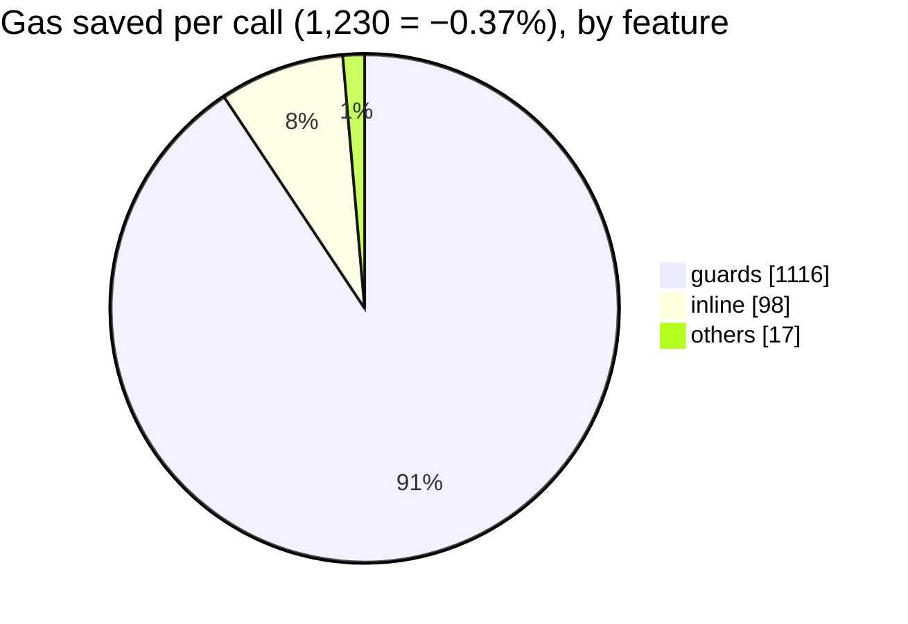
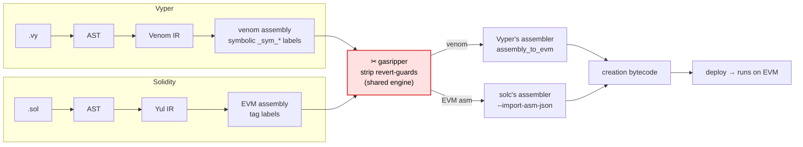

> ⚠️ **DISCLAIMER: gasripper performs SUPER-AGGRESSIVE gas optimization and may make UNSAFE changes to a contract.** This is safe ONLY when the contract is called by a trusted caller with known-correct calldata. For a publicly callable contract, stripping these checks creates vulnerabilities. Use at your own risk and always verify the result.

# gasripper

[](https://github.com/Nov1kov/gasripper/actions/workflows/ci.yml)
[](https://crates.io/crates/gasripper)
[](https://opensource.org/licenses/MIT)

A Rust CLI tool that maximally optimizes an EVM contract for gas. The goal is to **not change
execution logic**. Seven passes ship today — see the [feature matrix](#features) below.

## Results on a real contract

A live production venom contract, already compiled at Vyper's **maximum** gas optimization — the
language itself has nothing left to strip. Averaged over 64 real multi-hop swap routes, gasripper
still removes gas the compiler cannot, and the runtime bytecode only gets **smaller**:

**The killer feature — each bar is 100% of the compiler's output; the highlighted `▒` tail is what
gasripper shaves off (`█` kept · `▒` saved):**

```text
⛽ gas / call    329,869 → 328,639     saved 1,230   (−0.37%)
   █████████████████████████████████████████████████▒   ← saved < 1 char, see the zoom below

📦 bytecode      12,396 B → 11,468 B   saved 928 B   (−7.5%)
   ██████████████████████████████████████████████▒▒▒▒
```

**Magnified — that thin gas slice (1,230 / call) is almost all one pass; the rest are free extras
on top:**



| Feature | Gas saved / call | Share of the saving | vs. full call |
|---|---:|---:|---:|
| `guards` | −1,116 | 90.7% | −0.34% |
| `inline` | −98 | 8.0% | −0.03% |
| `others` | −17 | 1.4% | −0.005% |
| **total** | **−1,230** | **100%** | **−0.37%** |

The bytecode shrinks **even with inlining enabled** — the optimizer is a net reduction in size,
not a trade.

## How it works

Both compilers lower a contract to a **symbolic assembly** (labels not yet resolved to addresses).
gasripper strips the revert-guards at exactly that stage, then hands it back so the **compiler's own
assembler** links it to the final creation bytecode — no hand-written linker, constructor untouched.



## Installation

```bash
# from crates.io
cargo install gasripper

# or build from source
cargo build --release   # binary: target/release/gasripper
```

The optimizer core is a self-contained, pure-`std` binary — the Vyper sidecar script is
bundled inside it, so a `cargo install` needs no extra files.

**Optional: the SMT superoptimizer** (`superopt` pass — see [Features](#features)). Add `--features
smt` to pull in the Z3 solver (a prebuilt `libz3` is fetched at build time — needs network on the
first build, but no system Z3, cmake, or C++ toolchain):

```bash
cargo install --path . --features smt    # from a source checkout
```

One runtime caveat: an `smt` binary links `libz3` dynamically, and `cargo install` does **not** copy
the library next to the executable — without it the installed `gasripper` aborts with `error while
loading shared libraries: libz3`. Copy it once next to the binary (`~/.cargo/bin`); the exact command
per OS is in
[DEVELOPMENT.md](DEVELOPMENT.md#the-smt-feature-opt-in-superopt-pass). Running from a checkout
(`cargo run --features smt`) needs no copy.

The compilers are **runtime** tools, not build deps. They are only required for `.vy`/`.sol`
input and `--emit-creation`:

| Backend | Needs at runtime | Override |
|---|---|---|
| Solidity | `solc` on PATH (native Rust, no Python) | `GASRIPPER_SOLC` |
| Vyper | a Python with the `vyper` package importable | `GASRIPPER_VYPER_PYTHON` |

Raw `.asm`/`.evm`/`.hex`/`.bin` input needs no compiler at all.

## Usage

```bash
# report: what would be stripped (default behavior)
gasripper contract.asm

# write the optimized assembly
gasripper contract.asm --emit-asm out.asm

# write the optimized bytecode (non-symbolic input only: .hex/.bin)
gasripper --input-kind bytecode code.hex --emit-bytecode out.hex

# write deployable optimized CREATION bytecode (the product) — Vyper or Solidity
gasripper contract.vy  --emit-creation out.hex
gasripper contract.sol --emit-creation out.hex

# disable the strip and pin the EVM version
gasripper contract.vy --disable guards --evm-version cancun --emit-creation out.hex
```

## Input

| Type | Extension | How instructions are obtained |
|---|---|---|
| Raw assembly | `.asm` / `.evm` | parsed directly (including symbolic venom: `_sym_*`, `_OFST`, `_mem_`) |
| Raw bytecode | `.hex` / `.bin` | disassembled |
| Vyper contract | `.vy` | compiled with `vyper -f asm`, runtime body only — the deploy preamble is excluded (needs `vyper` in PATH, or set `GASRIPPER_VYPER_PYTHON`) — **experimental** |
| Solidity contract | `.sol` | compiled with `solc --bin-runtime` (needs `solc` in PATH) — **experimental** |

The type is detected by extension; it can be set explicitly with
`--input-kind <vyper|solidity|asm|bytecode>`. For input `-` (stdin) the type is required.

For a Vyper/Solidity source the **report and `--emit-asm` use the backend dump** (the same path
`--emit-creation` uses), so the report matches what would actually be assembled — in particular the
`inline` pass is visible. venom's internal-function symbols are multi-token (they contain spaces and
commas), which the plain `vyper -f asm` text frontend fragments; that frontend is kept only as a
fallback when the Vyper backend is unavailable (set `GASRIPPER_VYPER_PYTHON`), and the
`inline` count then reads 0.

### Creation bytecode (the product)

`--emit-creation` produces **deployable creation bytecode** — the hex you send in a deployment
transaction. 

```bash
# Vyper: a Python with `vyper` importable (tested on 0.4.3) — its assembler is a
# Python library function with no CLI, so this backend still needs the package
GASRIPPER_VYPER_PYTHON=/path/to/python gasripper contract.vy --emit-creation out.hex

# Solidity: just the solc binary (no Python — the asm-json round-trip is native Rust)
GASRIPPER_SOLC=/path/to/solc gasripper contract.sol --emit-creation out.hex
```

`GASRIPPER_VYPER_PYTHON` also selects the interpreter for the plain `.vy` frontend (it runs
`<python> -m vyper`).

## Features

A feature is one independent gas-reduction pass, lives in its own module, and is toggled
independently (**all enabled by default**). List them with `gasripper --list-features`. 

The matrix below shows where each pass finds something to optimize — ✓ = the compiler leaves
imperfections this pass removes, — = the pass is correct but finds nothing (the compiler already does
it). Both compilers' output is **already optimized** (Vyper venom `GAS`, solc `--optimize`), so a pass
fires only where its compiler leaves that specific class on the table.

| Feature                                                                                                                                                                                                                                                                                                                                                                                                              | Vyper | Solidity | Docs |
|----------------------------------------------------------------------------------------------------------------------------------------------------------------------------------------------------------------------------------------------------------------------------------------------------------------------------------------------------------------------------------------------------------------------|:---:|:---:|---|
| `guards` — strip provably-safe revert guards (overflow/underflow, ABI/calldata bounds, range/cast asserts). **Aggressive: safe only under a trusted caller** (see the disclaimer)                                                                                                                                                                                                                                    | ✓ | ✓ | [README](src/features/guards/README.md) |
| `shuffle` — reschedule a compiler's non-minimal `DUP`/`SWAP`/`POP` windows to the cheapest equivalent. Always safe — a pure stack reordering that changes no value                                                                                                                                                                                                                                                   | ✓ | — | [README](src/features/shuffle/README.md) |
| `involution` — cancel runs of an involutive op (`NOT NOT` → nothing). Always safe — a value applied to its own inverse is the value                                                                                                                                                                                                                                                                                  | ✓ | — | [README](src/features/involution/README.md) |
| `recompute` — rewrite a `DUP1` of a cheap result-invariant nullary opcode into a second copy (`OP DUP1` → `OP OP`, e.g. `CALLVALUE DUP1`). Always safe and length-preserving — the one pass that also lowers gas on raw concrete bytecode                                                                                                                                                                            | ✓ | ✓ | [README](src/features/recompute/README.md) |
| `foldshift` — precompute a constant `PUSH a PUSH b SHL/SHR` (e.g. solc's `1 << 160` address mask) into one push. Always safe — trades bytecode size for per-call gas                                                                                                                                                                                                                                                 | — | ✓ | [README](src/features/fold_shift/README.md) |
| `cmpnorm` — fold a `SWAP1` before a comparison into the mirrored comparator (`SWAP1 LT` → `GT`), e.g. venom's `(x * i) < (y * i)`. Always safe                                                                                                                                                                                                                                                                       | ✓ | — | [README](src/features/cmpnorm/README.md) |
| `inline` — relocate a small `@internal` function (2+ call sites) into its call sites, dropping the per-call indirection; tail-return and single-merge `if`/`else` bodies are de-threaded, other branching bodies relocated verbatim. Always safe. The first pass with a numeric parameter (`--inline-max-body`, default 30)                                                                                          | ✓ | — | [README](src/features/inline/README.md) |
| `superopt` — replace a pure straight-line block with a cheaper **SMT-proven-equivalent** sequence, discovered by search-and-prove rather than a fixed idiom: solc leaves a wrapping `((a+b)-b)^a` block Z3 collapses to `POP SWAP1`; venom leaves an idempotent `(a&b)&(a&b)` Z3 proves is `a&b`. Always safe. Search limits are tunable (`--superopt-max-block/-max-synth/-timeout-ms/-max-checks`, or the same `superopt_*` keys in `--config`). **Opt-in:** built only with `--features smt` (pulls in Z3); absent from the default pure-`std` binary | ✓ | ✓ | [README](src/features/superopt/README.md) |

### Disabling features

Any feature can be disabled in two ways (the CLI overrides the config):

```bash
# via the command line
gasripper contract.asm --disable guards

# via a config file
gasripper contract.asm --config gasripper.toml
```

`gasripper.toml` format (a TOML-compatible subset):

```toml
[features]
guards = false
shuffle = true
```

By default **no config file is needed or searched for** — the tool runs on defaults alone (all
features enabled), passing just the input path is enough.

## Operating point: already-maximally-optimized input

gasripper consumes the compiler's **already-optimized** symbolic assembly — *after* Vyper's venom
(`OptimizationLevel.GAS`) or Solidity's optimizer. The classic peephole and redundant storage-access
wins. 
The latest compiler releases pinned and tested in CI/e2e — gasripper tracks the **latest** release of
each language, driving the compiler's own assembler:

| Toolchain | Pinned version |
|---|---|
| Vyper | 0.4.3 |
| Solidity (solc) | 0.8.24 |

## Limitations

- gasripper **never guesses a linker**: bytecode comes only from a compiler's own assembler
  (`--emit-creation`) or exact `.hex`/`.bin` round-trips; symbolic `.asm` emits assembly text only.
- **Safe only with a trusted caller** — auth (`CALLER`/`ORIGIN`) and side effects are always preserved.

## Development

Tests, the shared real-EVM e2e harness, the sidecar toolchain setup, and how to add a new feature:
see [DEVELOPMENT.md](DEVELOPMENT.md).
