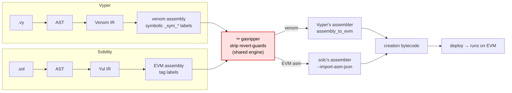

> ⚠️ **DISCLAIMER: gasripper performs SUPER-AGGRESSIVE gas optimization and may make UNSAFE changes to a contract.** This is safe ONLY when the contract is called by a trusted caller with known-correct calldata. For a publicly callable contract, stripping these checks creates vulnerabilities. Use at your own risk and always verify the result.

# gasripper

[](https://opensource.org/licenses/MIT)

A Rust CLI tool that maximally optimizes an EVM contract for gas. The goal is to **not change
execution logic** while shedding everything not needed for a bare run, using any provably-safe
transformation that lowers gas. Six passes ship today:

- **`guards`** — remove redundant revert guards (overflow/underflow, ABI/calldata bounds, range/cast
  asserts). Aggressive: safe **only** under a trusted caller (see the disclaimer).
- **`shuffle`** — reschedule a compiler's non-minimal `DUP`/`SWAP`/`POP` windows to the cheapest
  equivalent. **Always safe** — a pure stack reordering that changes no value, needing no trusted
  caller.
- **`involution`** — cancel runs of an involutive op (`NOT NOT` → nothing). **Always safe** — a value
  applied to its own inverse is the value, needing no trusted caller.
- **`recompute`** — rewrite a `DUP1` of a cheap result-invariant nullary opcode into a second copy of
  that opcode (`OP DUP1` → `OP OP`, e.g. `CALLVALUE DUP1`/`PUSH0 DUP1`). **Always safe** and
  length-preserving — the one pass that also lowers gas on raw concrete bytecode.
- **`foldshift`** — precompute a constant `PUSH a PUSH b SHL/SHR` (e.g. solc's `1 << 160` address
  mask) into a single push. **Always safe** — a self-contained constant. Trades bytecode size for
  per-call gas, the opposite of what the compiler optimizes for.
- **`cmpnorm`** — fold a `SWAP1` before a comparison into the mirrored comparator (`SWAP1 LT` → `GT`),
  e.g. venom's `(x * i) < (y * i)`. **Always safe** — swapping the operands and comparing equals the
  reversed comparator, needing no trusted caller.
- **`inline`** — relocate a small Vyper `@internal` function (one venom keeps separate, i.e. with two
  or more call sites) into its call sites, dropping the per-call indirection. A straight-line
  tail-return body and a single-merge `if`/`else` diamond are both **de-threaded** (the return address
  and the return `JUMP` eliminated, the body falling through to the continuation — the diamond also
  drops venom's redundant branch-arm double jump); other branching bodies are relocated verbatim.
  **Always safe** — a behavior-preserving relocation, needing no trusted caller. The first feature
  with a numeric parameter (`--inline-max-body`, default 20).

Fewer checks, cheaper stack juggling, and no wasted self-cancelling ops → less gas at execution time
and smaller bytecode. The design leaves room for further gas-reducing passes.

## Operating point: already-maximally-optimized input

gasripper consumes the compiler's **already-optimized** symbolic assembly — *after* Vyper's venom
(`OptimizationLevel.GAS`) or Solidity's optimizer. The classic peephole and redundant storage-access
wins (e.g. ebso's load-then-store-back, a repeated `SLOAD` of the same slot, recompute-a-cheap-opcode
vs. `DUP`) are **already eliminated by these optimizers**: on the latest compiler releases there are
provably no further *straight-line* wins of that class — verified empirically, both compilers do
common-subexpression elimination on straight-line storage reads and fold these peepholes, so the
optimized assembly contains none of them. gasripper therefore targets only what the compiler cannot
do (trusted-caller guard removal) or deliberately leaves on the table — non-minimal stack scheduling,
self-cancelling ops, and constant `SHL`/`SHR` materialization the compiler keeps un-folded to save
bytecode (`foldshift` re-folds it, spending bytecode to lower per-call gas).

The latest compiler releases pinned and tested in CI/e2e — gasripper tracks the **latest** release of
each language, driving the compiler's own assembler:

| Toolchain | Pinned version |
|---|---|
| Vyper | 0.4.3 |
| Solidity (solc) | 0.8.24 |

## How it works

Both compilers lower a contract to a **symbolic assembly** (labels not yet resolved to addresses).
gasripper strips the revert-guards at exactly that stage, then hands it back so the **compiler's own
assembler** links it to the final creation bytecode — no hand-written linker, constructor untouched.



## Features

A feature is one independent gas-reduction pass, lives in its own module, and is toggled
independently (**all enabled by default**). List them with `gasripper --list-features`. Each feature's
README has the full mechanism, soundness, and measured gas; the per-language safety argument lives
there, not duplicated here.

The matrix below shows where each pass finds something to optimize — ✓ = the compiler leaves
imperfections this pass removes, — = the pass is correct but finds nothing (the compiler already does
it). Both compilers' output is **already optimized** (Vyper venom `GAS`, solc `--optimize`), so a pass
fires only where its compiler leaves that specific class on the table.

| Feature | Vyper | Solidity | Trusted caller? | Docs |
|---|:---:|:---:|---|---|
| `guards` — strip provably-safe revert guards (overflow/bounds/range) | ✓ | ✓ | **required** (aggressive) | [README](src/features/guards/README.md) |
| `shuffle` — reschedule `DUP`/`SWAP`/`POP` windows to a cheaper equivalent | ✓ | — | not needed (always safe) | [README](src/features/shuffle/README.md) |
| `involution` — cancel runs of an involutive op (`NOT NOT` → nothing) | ✓ | — | not needed (always safe) | [README](src/features/involution/README.md) |
| `recompute` — recompute a cheap nullary opcode instead of `DUP`-ing it (`OP DUP1` → `OP OP`) | ✓ | ✓ | not needed (always safe) | [README](src/features/recompute/README.md) |
| `foldshift` — precompute a constant `PUSH a PUSH b SHL/SHR` into one push | — | ✓ | not needed (always safe) | [README](src/features/fold_shift/README.md) |
| `cmpnorm` — fold a `SWAP1` before a comparison into the mirrored comparator (`SWAP1 LT` → `GT`) | ✓ | — | not needed (always safe) | [README](src/features/cmpnorm/README.md) |
| `inline` — relocate a small internal function (2+ call sites) into its call sites, removing the call indirection | ✓ | — | not needed (always safe) | [README](src/features/inline/README.md) |

Each README (module docs + unit tests + a real-EVM e2e) is the template a new pass follows; see
[DEVELOPMENT.md](DEVELOPMENT.md).

### Disabling features

Any feature can be disabled in two ways (the CLI overrides the config):

```bash
# via the command line
gasripper contract.asm --disable guards

# via a config file
gasripper contract.asm --config gasripper.toml
```

`gasripper.toml` format (a TOML-compatible subset):

```toml
[features]
guards = false
shuffle = true
```

By default **no config file is needed or searched for** — the tool runs on defaults alone (all
features enabled), passing just the input path is enough.

## Input

| Type | Extension | How instructions are obtained |
|---|---|---|
| Raw assembly | `.asm` / `.evm` | parsed directly (including symbolic venom: `_sym_*`, `_OFST`, `_mem_`) |
| Raw bytecode | `.hex` / `.bin` | disassembled |
| Vyper contract | `.vy` | compiled with `vyper -f asm`, runtime body only — the deploy preamble is excluded (needs `vyper` in PATH, or set `GASRIPPER_VYPER_PYTHON`) — **experimental** |
| Solidity contract | `.sol` | compiled with `solc --bin-runtime` (needs `solc` in PATH) — **experimental** |

The type is detected by extension; it can be set explicitly with
`--input-kind <vyper|solidity|asm|bytecode>`. For input `-` (stdin) the type is required.

## Installation

```bash
cargo build --release
# binary: target/release/gasripper
```

The binary's only crate dependencies are `clap` (argument parsing) and `tracing` /
`tracing-subscriber` (diagnostic logging); the core builds offline. The compilers are runtime tools,
not build deps: `.vy`/`.sol` input and `--emit-creation` need `vyper` / `solc` installed (and a
Python to run the sidecar).

Diagnostic logs (compiler versions, errors) go to **stderr**; the report goes to **stdout**. Control
the log level with `RUST_LOG` (e.g. `RUST_LOG=debug`, `RUST_LOG=off`); the default is `info`.

## Usage

```bash
# report: what would be stripped (default behavior)
gasripper contract.asm

# write the optimized assembly
gasripper contract.asm --emit-asm out.asm

# write the optimized bytecode (non-symbolic input only: .hex/.bin)
gasripper --input-kind bytecode code.hex --emit-bytecode out.hex

# write deployable optimized CREATION bytecode (the product) — Vyper or Solidity
gasripper contract.vy  --emit-creation out.hex
gasripper contract.sol --emit-creation out.hex

# disable the strip and pin the EVM version
gasripper contract.vy --disable guards --evm-version cancun --emit-creation out.hex
```

### Creation bytecode (the product)

`--emit-creation` produces **deployable creation bytecode** — the hex you send in a deployment
transaction. Each language uses a thin sidecar (see [How it works](#how-it-works)) that re-assembles
with the compiler's own assembler:

| Language | Sidecar | Re-assembles with |
|---|---|---|
| Vyper | `scripts/vyper_sidecar.py` | Vyper's `assembly_to_evm` |
| Solidity | `scripts/solc_sidecar.py` | `solc --asm-json` ⇄ `--import-asm-json` |

A safety invariant guards every run: assembling with *no* deletions must reproduce the compiler's
own bytecode byte-for-byte, otherwise the tool fails fast (a compiler-version drift).

```bash
# Vyper: a Python with `vyper` importable (tested on 0.4.3)
GASRIPPER_VYPER_PYTHON=/path/to/python gasripper contract.vy --emit-creation out.hex

# Solidity: a Python (stdlib only) plus the solc binary
GASRIPPER_SOLC=/path/to/solc gasripper contract.sol --emit-creation out.hex
# overrides: GASRIPPER_{VYPER,SOLC}_SIDECAR (script path), GASRIPPER_SOLC_PYTHON (interpreter)
```

`GASRIPPER_VYPER_PYTHON` also selects the interpreter for the plain `.vy` frontend (it runs
`<python> -m vyper`). On Windows this is often required: a PyInstaller-frozen `vyper.exe` (e.g. the
one bundled with Foundry) ignores `PYTHONUTF8` and reads sources in the locale codec (cp1252), so a
contract with non-ASCII bytes — Cyrillic comments, say — aborts with a `UnicodeDecodeError`. Point
the variable at a real Python (a venv) and gasripper compiles it in UTF-8 mode.

For Solidity the solc sidecar normalizes both revert idioms — *direct* (`<cond> PUSH[revert_tag]
JUMPI`) and *inverse* (`<cond> PUSH[continue_tag] JUMPI; <inline revert>`, the `require` form) —
into the symbolic shape the shared engine expects, so the same engine strips both with no changes.

## Limitations

- gasripper **never guesses a linker**: bytecode comes only from a compiler's own assembler
  (`--emit-creation`) or exact `.hex`/`.bin` round-trips; symbolic `.asm` emits assembly text only.
- Guards are found by **symbolic revert labels**, so stripping needs symbolic assembly (the sidecar
  path); plain `.sol` disassembly has none and strips little.
- **Safe only with a trusted caller** — auth (`CALLER`/`ORIGIN`) and side effects are always preserved.

## Development

Tests, the shared real-EVM e2e harness, the sidecar toolchain setup, and how to add a new feature:
see [DEVELOPMENT.md](DEVELOPMENT.md).
