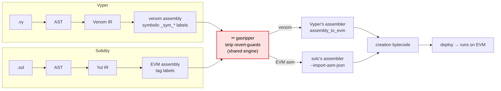

> ⚠️ **DISCLAIMER: gasripper performs SUPER-AGGRESSIVE gas optimization and may make UNSAFE changes to a contract.** This is safe ONLY when the contract is called by a trusted caller with known-correct calldata. For a publicly callable contract, stripping these checks creates vulnerabilities. Use at your own risk and always verify the result.

# gasripper

[](https://opensource.org/licenses/MIT)

A Rust CLI tool that maximally optimizes an EVM contract for gas. The goal is to **not change
execution logic** while removing everything not needed for a bare run: redundant revert guards
(overflow/underflow, ABI/calldata bounds, range/cast asserts). Fewer checks → less gas at
execution time and smaller bytecode.

## How it works

Both compilers lower a contract to a **symbolic assembly** (labels not yet resolved to addresses).
gasripper strips the revert-guards at exactly that stage, then hands it back so the **compiler's own
assembler** links it to the final creation bytecode — no hand-written linker, constructor untouched.



## Safety model

Everything rests on a stack criterion. For each `<cond> _sym_*revert* JUMPI`, gasripper grows the
longest barrier-free suffix it can cut by **reproducing that run's live-stack residue** (simulated
over slot-ids) — so the fall-through (non-reverting) stack is byte-for-byte unchanged, only the
revert is gone:

- a check that reads its inputs via `DUP`/`SWAP` is a stack **identity** → deleted outright;
- a check that **consumes** its inputs (e.g. a Vyper `a + b` overflow assertion, which keeps the
  `ADD` but consumes the spare operand) is replaced by the minimal `POP`/`SWAP` shuffle that
  reproduces its residue — removing the comparison + branch + revert while keeping the stack and
  the live computation intact.

A run is removed only if its residue consists solely of input slots (it creates no value that
survives into live code). Residue strips that *drop* a value are additionally refused when their
straight-line block contains an auth (`CALLER`/`ORIGIN`) or side-effect opcode, so a `msg.sender`
check or a call's success flag is never dropped.

**Always preserved** (never stripped, regardless of enabled features):

- authorization — any run touching `CALLER`/`ORIGIN` (`msg.sender == owner`);
- side effects — `SSTORE`/`CALL`/`MSTORE`/`LOG*`/`RETURN`/…;
- checks that consume their own input (not a stack identity — possible profit guards);
- any suffix containing a label or a non-terminal `JUMP(I)`.

Safe **only** under a trusted caller — see the disclaimer. The preservation sets `is_auth`/`is_side`
live in `src/core/strip.rs`.

## Features

Each feature removes one class of guard, lives in its own module, and is toggled independently
(**all enabled by default**). List them with `gasripper --list-features`.

| Key | Strips | Docs |
|---|---|---|
| `math` | overflow/underflow and arithmetic revert checks | [`src/features/strip_math/README.md`](src/features/strip_math/README.md) |
| `abi` | ABI/calldata bounds checks (length/offset validation) | [`src/features/strip_abi/README.md`](src/features/strip_abi/README.md) |
| `assert` | other range/cast assert checks (neither abi nor math) | [`src/features/strip_assert/README.md`](src/features/strip_assert/README.md) |

`abi` is the **reference feature** — its [README](src/features/strip_abi/README.md) is the template
(module docs + unit tests + a real-EVM e2e) every feature follows. Adding a feature:
see [DEVELOPMENT.md](DEVELOPMENT.md).

### Disabling features

Any feature can be disabled in two ways (the CLI overrides the config):

```bash
# via the command line
gasripper contract.asm --disable math,abi

# via a config file
gasripper contract.asm --config gasripper.toml
```

`gasripper.toml` format (a TOML-compatible subset):

```toml
[features]
math   = false
abi    = true
assert = true
```

By default **no config file is needed or searched for** — the tool runs on defaults alone (all
features enabled), passing just the input path is enough.

## Input

| Type | Extension | How instructions are obtained |
|---|---|---|
| Raw assembly | `.asm` / `.evm` | parsed directly (including symbolic venom: `_sym_*`, `_OFST`, `_mem_`) |
| Raw bytecode | `.hex` / `.bin` | disassembled |
| Vyper contract | `.vy` | compiled with `vyper -f asm` (needs `vyper` in PATH) — **experimental** |
| Solidity contract | `.sol` | compiled with `solc --bin-runtime` (needs `solc` in PATH) — **experimental** |

The type is detected by extension; it can be set explicitly with
`--input-kind <vyper|solidity|asm|bytecode>`. For input `-` (stdin) the type is required.

## Installation

```bash
cargo build --release
# binary: target/release/gasripper
```

The binary has **no external crates** (pure `std`, builds offline). The compilers are runtime tools,
not build deps: `.vy`/`.sol` input and `--emit-creation` need `vyper` / `solc` installed (and a
Python to run the sidecar).

## Usage

```bash
# report: what would be stripped and by which categories (default behavior)
gasripper contract.asm

# write the optimized assembly
gasripper contract.asm --emit-asm out.asm

# write the optimized bytecode (non-symbolic input only: .hex/.bin)
gasripper --input-kind bytecode code.hex --emit-bytecode out.hex

# write deployable optimized CREATION bytecode (the product) — Vyper or Solidity
gasripper contract.vy  --emit-creation out.hex
gasripper contract.sol --emit-creation out.hex

# disable a category and pin the EVM version
gasripper contract.vy --disable assert --evm-version cancun --emit-creation out.hex
```

### Creation bytecode (the product)

`--emit-creation` produces **deployable creation bytecode** — the hex you send in a deployment
transaction. Each language uses a thin sidecar (see [How it works](#how-it-works)) that re-assembles
with the compiler's own assembler:

| Language | Sidecar | Re-assembles with |
|---|---|---|
| Vyper | `scripts/vyper_sidecar.py` | Vyper's `assembly_to_evm` |
| Solidity | `scripts/solc_sidecar.py` | `solc --asm-json` ⇄ `--import-asm-json` |

A safety invariant guards every run: assembling with *no* deletions must reproduce the compiler's
own bytecode byte-for-byte, otherwise the tool fails fast (a compiler-version drift).

Point the tool at the right toolchain via the environment:

```bash
# Vyper: a Python with `vyper` importable (tested on 0.4.3)
GASRIPPER_VYPER_PYTHON=/path/to/python gasripper contract.vy --emit-creation out.hex

# Solidity: a Python (stdlib only) plus the solc binary
GASRIPPER_SOLC=/path/to/solc gasripper contract.sol --emit-creation out.hex
# overrides: GASRIPPER_{VYPER,SOLC}_SIDECAR (script path), GASRIPPER_SOLC_PYTHON (interpreter)
```

For Solidity the solc sidecar normalizes both revert idioms — *direct* (`<cond> PUSH[revert_tag]
JUMPI`) and *inverse* (`<cond> PUSH[continue_tag] JUMPI; <inline revert>`, the `require` form) —
into the symbolic shape the shared engine expects, so the same engine strips both with no changes.

## Limitations

- gasripper **never guesses a linker**: bytecode comes only from a compiler's own assembler
  (`--emit-creation`) or exact `.hex`/`.bin` round-trips; symbolic `.asm` emits assembly text only.
- Guards are found by **symbolic revert labels**, so stripping needs symbolic assembly (the sidecar
  path); plain `.sol` disassembly has none and strips little.
- **Safe only with a trusted caller** — auth (`CALLER`/`ORIGIN`) and side effects are always preserved.

## Development

Tests, the shared real-EVM e2e harness, the sidecar toolchain setup, and how to add a new feature:
see [DEVELOPMENT.md](DEVELOPMENT.md).
