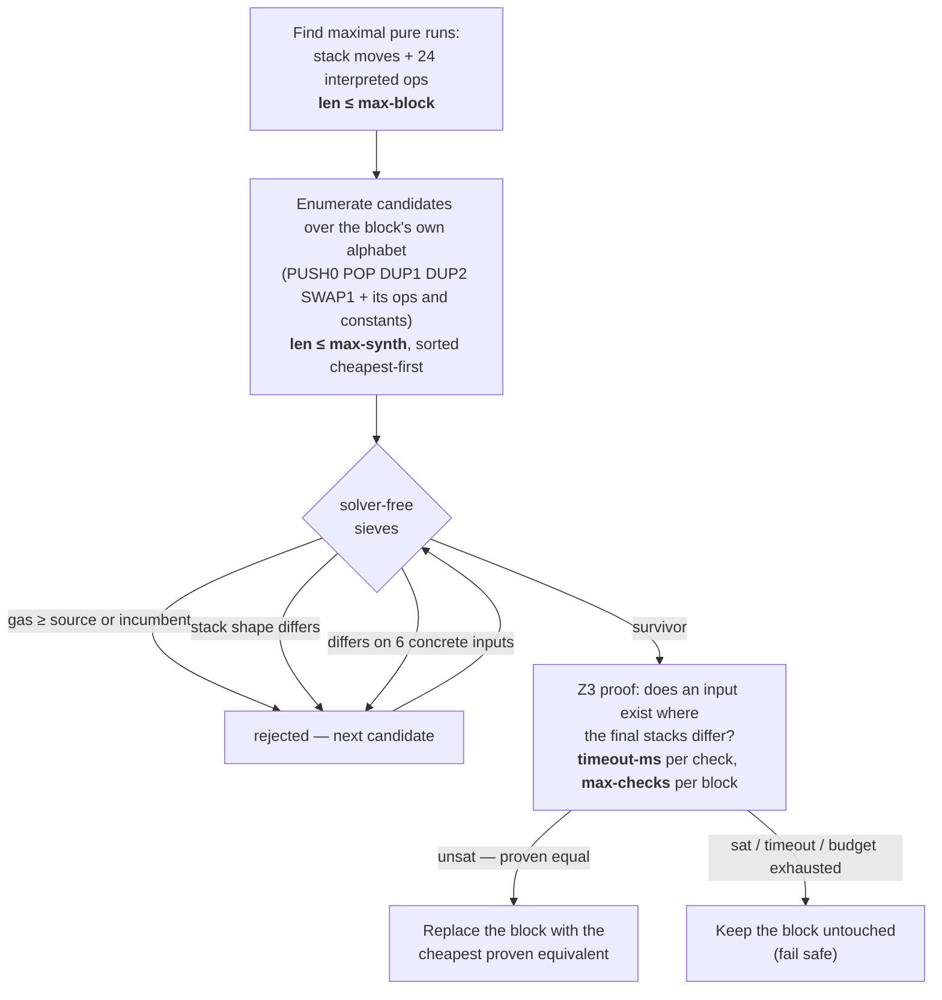

# Feature `superopt` — SMT block superoptimization (opt-in, `smt` feature)

Project-wide safety model: [main README](../../../README.md).

> **Opt-in.** Pulls in the Z3 solver, so it is gated behind the `smt` Cargo feature and absent from
> the default pure-`std` binary. Build/test with `cargo build/test --features smt`. Long scans log
> progress via `tracing` at `info` level (throttled; silence with `RUST_LOG=warn`).

## How it works

For every maximal **pure straight-line block** the pass searches for a cheaper instruction sequence
and **proves** with Z3 that the replacement leaves the identical final stack on every 256-bit input.
No fixed idiom — it *discovers* rewrites, so it catches identities the compiler's optimizer missed.
Candidates die in cheap-to-expensive sieves; the solver only ever sees near-certain rewrites.



## The four search limits

Tunable with the usual precedence: defaults → `superopt_*` keys in a `--config` file →
`--superopt-*` CLI flags. The defaults are what the e2e gas pins are proven against; raising them
trades scan time for search power.

| Flag (config key) | Default | Bounds | Raising it |
|---|---|---|---|
| `--superopt-max-block` (`superopt_max_block`) | 24 | longest pure run analyzed; longer runs are skipped whole | covers longer blocks, near-free |
| `--superopt-max-synth` (`superopt_max_synth`) | 4 | longest replacement synthesized; 4 fits the smallest solc-shaped rewrite (`POP POP PUSH0 SWAP1` around the threaded return address) | finds longer optima at exponential enumeration cost |
| `--superopt-timeout-ms` (`superopt_timeout_ms`) | 500 | Z3 time per equivalence check; a timeout reads as "not proven" | deeper proofs over nonlinear terms, slower refutations |
| `--superopt-max-checks` (`superopt_max_checks`) | 128 | solver checks per block; an exhausted budget keeps the block | lets more survivors reach the solver on hostile blocks |

## Examples it actually optimizes (after the compiler)

Compilers fold the easy cases (`x+0`, CSE, …); what survives — and `superopt` removes — is
redundancy the optimizer **can't prove away**: wrapping arithmetic identities and idempotent ops.

**Solidity** (solc 0.8.24 `--optimize`) — wrapping `((a+b)-b)^a == 0`:

```solidity
function f(uint256 a, uint256 b) external pure returns (uint256 r) {
    unchecked {
        uint256 s = a + b;
        uint256 t = s - b;   // == a
        uint256 u = t * 1;   // == a
        uint256 v = u + 0;   // == a
        r = v ^ a;           // == 0
        r = r + a;           // == a
    }
}
```

solc leaves the 8-op block `DUP2 DUP2 ADD SUB DUP2 XOR ADD SWAP1`; Z3 proves it equals `POP SWAP1`.
**Block gas 24 → 5 (−19).** The contract still returns `a`.

**Vyper** (venom 0.4.3) — idempotent `(a & b) & (a & b) == a & b`:

```vyper
@external
@view
def f(a: uint256, b: uint256) -> uint256:
    return (a & b) & (a & b)
```

venom leaves the self-`AND` as `AND DUP1 AND`; Z3 proves it is just `a & b`. **Block gas 17 → 10 (−7).**

The newer interpreted opcodes fire the same way (`e2e.rs::*_new_interpreted_ops_superoptimized`):
wrapping `((a+b)-b) < a`, `mulmod(a+b, a-b, 1)` and the doubled `(a >> 255) >> 255` on solc;
`uint256_mulmod(m, m, m)`, the doubled `SAR` and the wrapping `SLT` on venom. Single-shot wins sit
under the EIP-7623 calldata floor (the e2es pin the block-gas drop and the exact tx gas), so each
e2e also runs a `bench` hot loop whose whole body is a mulmod-by-one identity: **−5800 tx gas** on
solc, **−4000** on venom over 200 iterations. A compiler-free proof collapses a hand-assembled
`x + 0 + 0 + 0` block to one `PUSH0` for a pinned **−19 tx gas** (empty calldata, no floor).

## How it is sound

Only side-effect-free, control-flow-free, fully concrete opcodes are eligible, so a block-local
replacement is valid in any surrounding program (ebso's replacement lemma). The interpreted opcodes
map exactly onto EVM mod-2^256 semantics, and a rewrite is emitted **only on a Z3 `unsat` proof** of
non-equivalence — a timeout or anything unproven leaves the block untouched (wrong bytecode in a gas
tool is dangerous).

## Scope

- EVM special cases are modeled exactly: division/mod by zero → 0, `ADDMOD`/`MULMOD` reduce the full
  512-bit intermediate, `BYTE` past index 31 → 0, `SIGNEXTEND` past byte 30 is the identity.
- Excluded: `EXP` (no closed bit-vector form, dynamic gas) and anything with a side effect,
  memory/storage access, or control flow. A symbolic `PUSH [tag]` ends the run (link-time value);
  solc's bare literal `PUSH` is priced like any sized push.
- **Symbolic input only** in the pipeline: a cheaper block has a different length and shifts later
  `JUMPDEST` offsets, so — like [`shuffle`](../shuffle/README.md)/[`cmpnorm`](../cmpnorm/README.md) —
  it runs only where the compiler relinks; an overlapping earlier span wins.
